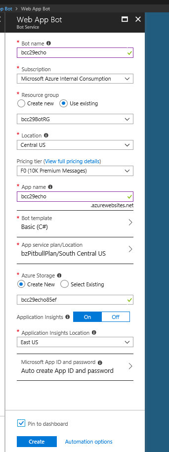

 
BCC29, April 7, 2018, 10:15AM Adams

# Intro to the Microsoft Bot Framework with Azure Cognitive Services to easily create a powerful AI bot for Twitter, Slack + more

The Microsoft Bot Framework and Azure Cognitive Services provide the ability for you to easily use powerful AI algorithms developed by experts with a Bot that users can interact with using conversational language with minimal coding. Cognitive Services make it possible for your Bot to see, hear, speak, understand and interact with users using natural conversations. The experts have done the hard AI work so you can leverage their efforts with a few lines of code. 

You can focus on developing your Bot while the Framework handles the heavy lifting of deploying your single Bot implementation to multiple 3rd party services like Slack, Twitter, Skype, Office and more. 
In this session, I will demonstrate the Bot Framework with a free version of Visual Studio and C# to leverage powerful AI capabilities. You will walk away knowing how to use the Bot Framework, where to find and how to use the growing list of Cognitive Services to quickly make your own intelligent Bot and how to easily deploy to 3rd party channels like Twitter, Slack, etc.

Beth Zeranski 

@BethZeranski 

https://www.bostoncodecamp.com/CC29/sessions/details/16630


<!-- Ctrl K  V  split and preview VS -->
<!-- Ctrl shift V preview md file -->
<!-- Ctl \ side by side -->
<!-- Toggle side bar Ctrl B -->

# Introduction

We are going to demonstrate how to create a Bot which uses Cognitive Services to make your own intelligent Bot and deploy it to a 3rd party channel.

There are 3 goals for this talk:
1. Demonstrate the Microsoft Bot Framework and how easy it is to create a simple bot to consume AI Services
2. Introduce a wide range of AI Services that are available 
3. Create a simple bot to consume AI services that you can leverage for more exciting work!


Here's what we'll cover:

1. Sign into Azure

1. What is a bot and why do we want to use one?

1. Create Azure Echo Bot in less than ~5 min!

1. Deploy Azure Echo Bot to Skype in less than ~5 min!

1. Review Additional Azure Echo Bot Information

1. Review Azure Echo Bot code highlights

1. Demo LUIS, Language Understanding
    - Intents
    - utterances

1. Create Azure AI Bot with LUIS Language Understanding

1. Review AI Bot code highlights

1. If time, try intents or utterances

***


## 1. First, sign into Azure.
The Azure portal is at http://portal.azure.com/.

```If you do not already have a subscription, you can register for a free account at https://azure.microsoft.com/en-us/free/.```


## 2. What is a bot and why do we want to use one?

Bots, or ChatBots, are a convenient way to interact conversationally. They are an interface to a service. Natural Language, or a CUI, Conversational User Interface,  is considered to be more easier and more natural for people than a GUI, Graphical User Interface which requires a mouse or typing.

Many channels available for easy integration.


Your bot interfaces with the Bot Connector and the Bot Connector handles the complexity of interfacing to the many channels.


Other good reasons include:
- Quick to create a Bot proof-of-concept
- Easier to deploy than an app
- Easier to create than app
- Any device
- Platform Independent
- AI services available
- Nearly anyone can use
- Widespread support

## 3. Create Azure Echo Bot

We're going to create a new bot service by clicking **Create a resource** found in the upper left-hand corner of the Azure portal. 


Then, where it reads **Search the Marketplace**, type bot followed by the **Enter key** as shown in the image below. A new blade will open. 

Select **Web App Bot**.


A blade will will open to the right. Select **Create** in the bottom portion of the screen.


A new blade will open the Bot Service configuration panel. Fill in the requested information. 
Provide a Bot name, create a new Resource Group to conveniently group resources together, and other information. [This web site](https://docs.microsoft.com/en-us/azure/bot-service/bot-service-quickstart) provides detailed descriptions of the fields. 

``` **Note: Ensure the Bot Template is Basic (C#) ```

``` **Note: Ensure that pin to dashboard is selected to make it easier to find your bot```




Finish providing information. Here is more info about the information.


Select **Create** to begin creation of the Bot Service
. This may take several seconds.
Azure is creating all of the base code needed for your bot.

Because you selected **Pin to Dashboard**, the bot will be pinned to your Azure Dashboard which makes it easier to find.

Here's my dashboard with a couple of bots.
Select your bot by double clicking it.


Selecting your bot shows an overview of your bots information. You can find most of your bot's management options under **Bot Management**.


Your Azure Echo Bot is already running! 
And you didn't have to write **any** code!

We will now test the bot in Web Chat, an emulator on Azure.
Select **Test in Web Chat**.

To test, type **Hello** on the bottom of the window where it says **Type your message...**.


See some examples of the Azure Echo Bot successfully echoing what was typed. The response confirms that the bot has received the message. Notice that each response is prepended by a number.  We can input commands that affect the Bot's response.


Here, **reset** causes the Bot to query if we want to reset the count in the response The bot prompts for yes/no. Selecting yes will set the count to zero and no will leave the count as-is.


Here you can see the message **Reset count**  and the count reset to 1 in the message.


Let's investigate some of the other available items in the menu that you may use for future development.


## 3. Deploy Azure Echo Bot to Skype

Next, select **Channels** in the Azure portal. This will provide a list of potential targets for you to deploy your bot. The code for the integration is handled by the Bot Framework.  For this example, we'll choose Skype.


Select Skype as the target to deploy. You have the option to set up multiple targets but for this example we'll do just Skype.


Once we've selected Skype, no additional configuration is needed for this demo. 

If Health says **Warning** instead of running, click it. Generally, the warning is usually related to a startup issue and you can just clear the message.

If it's not already running, start Skype on your system.

Then, click the word **Skype**  to pop up a page which will enable you to add your bot to your contacts in Skype.


Click Add to Contacts.


Then, look in Skype for your Bot.


Type a message.


## 4. Review Additional Azure Echo Bot Information

Let's look at a **Settings**. These will be needed if you build your bot in your own development environment outside of Azure.


Next, we'll check out **Build**. 

You are offered the opportunity to use an online editor to view or make changes to your code, download the code as a zip file or for continuous deployment.


However, the areas on the configure pane will require personalization for other bot development. In particular, Publish must be completed when there are more than 100 users.

The Web Control enables devs to embed the bot in their own website. We will not be embedding the bot in a website in this demo.


Calling and Groups does not require any configuration for our demo.  Bots are in preview are limited to 100 contacts. If you require more than 100 contacts, then Review Guidelines for publishing the bot if you require more than 100 contacts.


## 5. Review Azure Echo Bot Code Highlights

First the Post Method within Controllers\MessagesController.cs 
 receives the message from the user and invokes the echo dialog.

```c#
 [BotAuthentication]
    public class MessagesController : ApiController
    {
        /// <summary>
        /// POST: api/Messages
        /// receive a message from a user and send replies
        /// </summary>
        /// <param name="activity"></param>
        [ResponseType(typeof(void))]
        public virtual async Task<HttpResponseMessage> Post([FromBody] Activity activity)
        {
            // check if activity is of type message
            if (activity != null && activity.GetActivityType() == ActivityTypes.Message)
            {
                await Conversation.SendAsync(activity, () => new EchoDialog());
            }
            else
            {
                HandleSystemMessage(activity);
            }
            return new HttpResponseMessage(System.Net.HttpStatusCode.Accepted);
        }
        ...
    }
```


The EchoDialog processes the message and generates a response.  The MessageReceivedAsync method within Dialogs\EchoDialog.cs sends a reply that echos back the user's message. 

If the message text is "reset", the bot will confirm you intended to reset the count and will then reset the count.

Else, the count of the response is prepended to "You said " followed by the input text.


```c#
    [Serializable]
    public class EchoDialog : IDialog<object>
    {
        protected int count = 1;

        public async Task StartAsync(IDialogContext context)
        {
            context.Wait(MessageReceivedAsync);
        }

        public async Task MessageReceivedAsync(IDialogContext context, IAwaitable<IMessageActivity> argument)
        {
            var message = await argument;

            if (message.Text == "reset")
            {
                PromptDialog.Confirm(
                    context,
                    AfterResetAsync,
                    "Are you sure you want to reset the count?",
                    "Didn't get that!",
                    promptStyle: PromptStyle.Auto);
            }
            else
            {
                await context.PostAsync($"{this.count++}: You said {message.Text}");
                context.Wait(MessageReceivedAsync);
            }
        }
```

## 6. Demo LUIS, Language Understanding

## 7. Create Azure AI Bot with LUIS Language Understanding


In order to understand natural language, we will leverage some artificial intelligence work that's already been created by Microsoft. Follow the same procedure we used to create your echo bot to create a new, smarter bot.
For the bot template, in the bot service blade, select Language understanding c# instead of Basic(C#). Then create the bot as before.


Azure will connect your bot to the LUIS app and provides all needed code for this demo.

Let's look at BasicLuisDialog.cs.

```c#
using System;
using System.Configuration;
using System.Threading.Tasks;

using Microsoft.Bot.Builder.Dialogs;
using Microsoft.Bot.Builder.Luis;
using Microsoft.Bot.Builder.Luis.Models;

namespace Microsoft.Bot.Sample.LuisBot
{
    // For more information about this template visit http://aka.ms/azurebots-csharp-luis
    [Serializable]
    public class BasicLuisDialog : LuisDialog<object>
    {
        public BasicLuisDialog() : base(new LuisService(new LuisModelAttribute(
            ConfigurationManager.AppSettings["LuisAppId"], 
            ConfigurationManager.AppSettings["LuisAPIKey"], 
            domain: ConfigurationManager.AppSettings["LuisAPIHostName"])))
        {
        }

        [LuisIntent("None")]
        public async Task NoneIntent(IDialogContext context, LuisResult result)
        {
            await this.ShowLuisResult(context, result);
        }

        // Go to https://luis.ai and create a new intent, then train/publish your luis app.
        // Finally replace "Gretting" with the name of your newly created intent in the following handler
        [LuisIntent("Greeting")]
        public async Task GreetingIntent(IDialogContext context, LuisResult result)
        {
            await this.ShowLuisResult(context, result);
        }

        [LuisIntent("Cancel")]
        public async Task CancelIntent(IDialogContext context, LuisResult result)
        {
            await this.ShowLuisResult(context, result);
        }

        [LuisIntent("Help")]
        public async Task HelpIntent(IDialogContext context, LuisResult result)
        {
            await this.ShowLuisResult(context, result);
        }

        private async Task ShowLuisResult(IDialogContext context, LuisResult result) 
        {
            await context.PostAsync($"You have reached {result.Intents[0].Intent}. You said: {result.Query}");
            context.Wait(MessageReceived);
        }
    }
}
```

## 7. 
Put build and how to rebuild in console
Visual Studio Code running in a browser is called Monaco.


SKype for devs
https://dev.skype.com/bots


If needed, can restart bot from all app service menu restart
Helpful URLs:

https://docs.microsoft.com/en-us/azure/bot-service/bot-service-quickstart

favorite references:
https://docs.microsoft.com/en-us/azure/bot-service/bot-service-quickstart
https://dev.skype.com/bots

### Prebuilt entity reference
https://docs.microsoft.com/en-us/azure/cognitive-services/LUIS/luis-reference-prebuilt-entities

### Bot Framework Additional Resources
https://docs.microsoft.com/en-us/azure/bot-service/bot-service-resources-links-help

## Key Concepts in Bot Builder SDK
https://docs.microsoft.com/en-us/azure/bot-service/dotnet/bot-builder-dotnet-concepts

https://docs.microsoft.com/en-us/azure/bot-service/dotnet/bot-builder-dotnet-samples

https://github.com/Microsoft/BotBuilder-Samples/tree/master/CSharp/intelligence-ImageCaption

# Thank you to our sponsors


