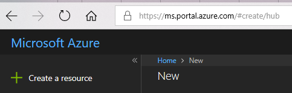
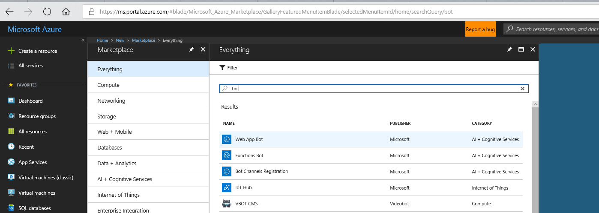
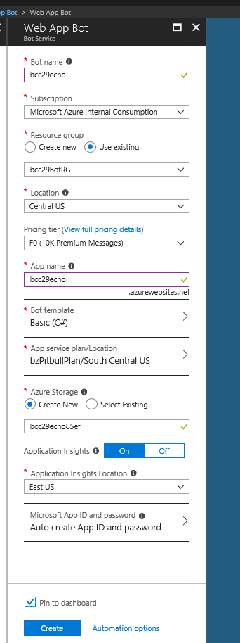
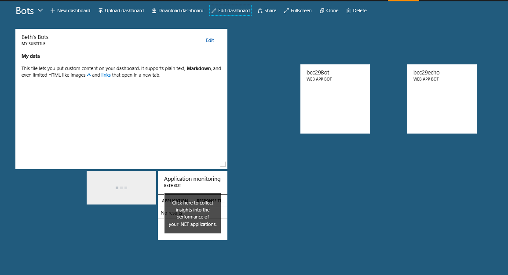
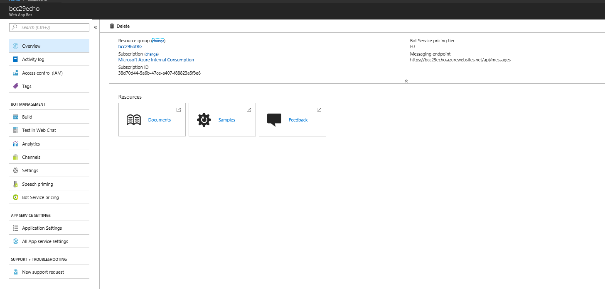
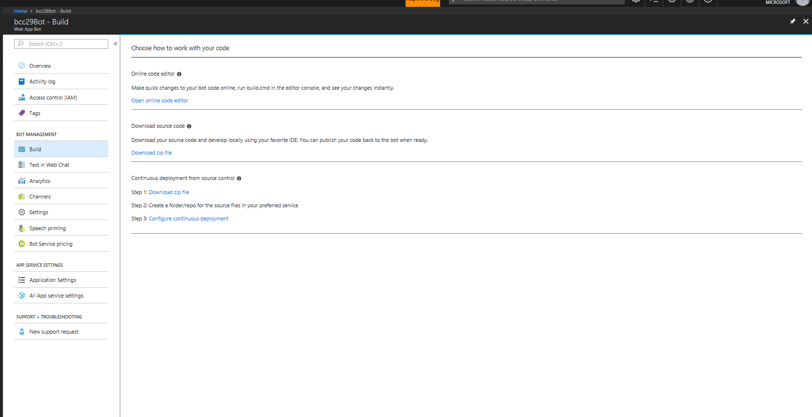
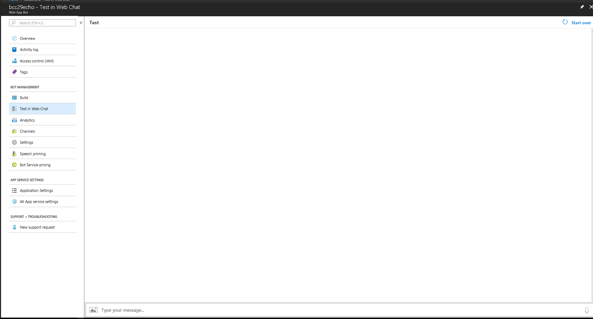
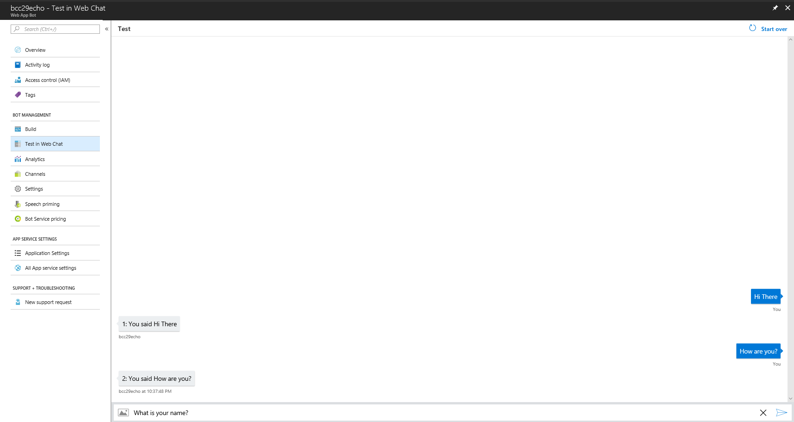
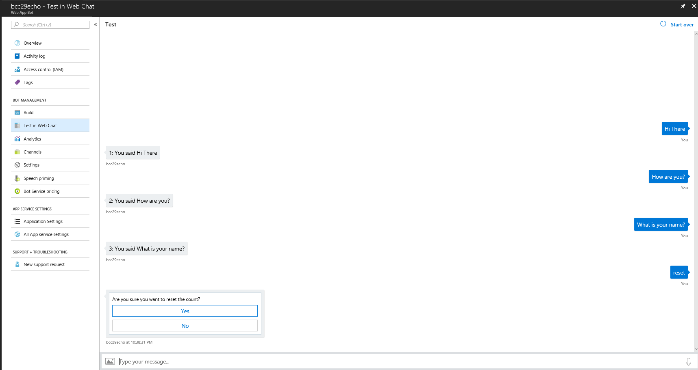

 
BCC29, April 2018

# Intro to the Microsoft Bot Framework with Azure Cognitive Services to easily create a powerful AI bot for Twitter, Slack + more

The Microsoft Bot Framework and Azure Cognitive Services provide the ability for you to easily use powerful AI algorithms developed by experts with a Bot that users can interact with using conversational language with minimal coding. Cognitive Services make it possible for your Bot to see, hear, speak, understand and interact with users using natural conversations. The experts have done the hard AI work so you can leverage their efforts with a few lines of code. 

You can focus on developing your Bot while the Framework handles the heavy lifting of deploying your single Bot implementation to multiple 3rd party services like Slack, Twitter, Skype, Office and more. 
In this session, I will demonstrate the Bot Framework with a free version of Visual Studio and C# to leverage powerful AI capabilities. You will walk away knowing how to use the Bot Framework, where to find and how to use the growing list of Cognitive Services to quickly make your own intelligent Bot and how to easily deploy to 3rd party channels like Twitter, Slack, etc.

10:15AM Adams

Beth Zeranski 

@BethZeranski 

https://www.bostoncodecamp.com/CC29/sessions/details/16630

# Overview

We are going to create a Bot which uses Cognitive Services to make your own intelligent Bot and deploy it to a 3rd party channel.

Here is what we will do:

1. Sign into Azure

1. Create Azure Echo Bot

   Time Required ~< 5 min

1. Deploy Azure Echo Bot to Skype

   Time Required ~< 5 min

1. Review Azure Echo Bot code highlights

1. Demo LUIS, Language Understanding
    - Intents
    - utterances

1. Create Azure AI Bot with LUIS Language Understanding

   Time Required ~< 5 min

1. Review AI Bot code highlights

1. If time, try intents or utterances

***
1. First, sign into the [Azure portal](http://portal.azure.com/).

```If you do not already have a subscription, you can register for a [free account](https://azure.microsoft.com/en-us/free/).
```

2. Create Azure Echo Bot

We're going to create a new bot service by clicking **Create a resource** found in the upper left-hand corner of the Azure portal. 





Then, where it reads **Search the Marketplace**, type bot followed by the **Enter key** as shown in the image below. A new blade will open. Select **Web App Bot**.

A new blade, Web App Bot, will open for you to provide information for the Bot Service. Fill in the requested information. Next, you can fill in the Bot name, create a new Resource Group to conveniently group resources together, and other information. 





A new blade will open for you to provide information for the Bot Service. Fill in the requested information. Next, you can fill in the Bot name, create a new Resource Group to conveniently group resources together, and other information. 

``` **Note: Ensure the Bot Template is Basic (C#) ```
``` **Note: Ensure that pin to dashboard is selected to make it easier to find your bot```

Finish providing information and select **Create** to create the Bot Service and deploy to Azure. This may take several seconds.
Azure is creating all of the base code needed for your bot.





Here's my dashboard with a couple of bots.
Select bcc29echo by double clicking it.



This provides an overview of your bots information.



Let's investigate some of the other available items in the menu.
Next, we'll check out **Build**. You are offered the opportunity to use an online editor to view or make changes to your code, download the code as a zip file or for continuous deployment.
We will test the bot in Web Chat, an emulator on Azure, deploy to Azure and then dive into the code.



The Azure Echo Bot is running and we will test it in Web Chat. Type in **Hello** on the bottom of the window where it says **Type your message...**.




See some examples of the Azure Echo Bot successfully echoing what was typed. Notice that each response is prepended by a number.  We can input commands that affect the Bot's response.



Here, **reset** entered causes the Bot to query if we want to reset the count. Selecting yes will set the count to zero and no will leave the count as-is.




SKype for devs
https://dev.skype.com/bots

Helpful URLs:

https://docs.microsoft.com/en-us/azure/bot-service/bot-service-quickstart


src="
### 1.1 Visual Studio Community
    
    Install [Visual Studio Community](https://www.visualstudio.com/thank-you-downloading-visual-studio/?sku=Community&rel=15)
    
   Other: The code for the Bot Builder SDK is in [Github](https://github.com/Microsoft/BotBuilder).
   
1.2 Bot Framework

   Download the [Bot Application](http://aka.ms/bf-bc-vstemplate), [Bot Controller](http://aka.ms/bf-bc-vscontrollertemplate), and [Bot Dialog](http://aka.ms/bf-bc-vsdialogtemplate) .zip files. Install the project template by copying Bot Application.zip to your Visual Studio 2017 project **templates directory**. Install the **item templates** by copying Bot Controller.zip and Bot Dialog.zip to your Visual Studio 2017 item templates directory.

The Visual Studio 2017 project **templates directory** is typically located at:
%USERPROFILE%\Documents\Visual Studio 2017\Templates\ProjectTemplates\Visual C#\ 

The **item templates directory** is at %USERPROFILE%\Documents\Visual Studio 2017\Templates\ItemTemplates\Visual C#\
   
1.3 Azure - free account to use free Bot service
1.4 Bot Emulator
 The Bot Emulator Framework is a desktop application that lets you test and debug your bot on localhost or running remotely through a tunnel. It is available [here](https://docs.microsoft.com/en-us/azure/bot-service/bot-service-debug-emulator).
 
Optional:

1.5 Git - if you want to copy my code


***
2.0 Develop an Echo Bot in Visual Studio Community 2017.

2.1 Create Your Bot in Visual Studio

Next, open Visual Studio and create a new C# project. Choose the Bot Application template for your new project and name it MyFirstBot.

The Bot Application template provides the ability to create a project that contains all of the components needed to build a simple echo Bot without writing any additional code. 

Verify that your project references the latest version of the SDK:

Right-click on the project and select Manage NuGet Packages.

In the Browse tab, type "Microsoft.Bot.Builder".
Locate the Microsoft.Bot.Builder package in the list of search results.
Click the Update button for the Microsoft Bot Builder package.
Follow the prompts to accept the changes and update the package.

Add Microsoft.bot.builder.cognitiveservices?

<Look at code after emulator>
<ctl + mouse for increase/decrease font> 
   
3.0 Test your Bot in the Bot Emulator   
    You are now ready to run your Bot in the Bot Framework Emulator to test it out.
    
3.1 Start your Bot in Visual Studio

3.1.1 Click the run button.
<image>

Visual Studio will build the Bot, deploy it to localhost and launch a web browser to display the Bot's default.htm page.
Your Bot is now running locally.
**Note the url in the default.htm page. The port number will be used later**
 
<image>

3.2 Start the Emulator
<image>
   Run the BotFramework-emulator desktop application. Connect to your Bot by typing this in the address bar in the emulator:
   
  '''http://localhost:3979/api/messages'''   

Note: The port number, shown here as 3979, may be a different number on your system and was obtained from step 3.1.1 . 

Leave Microsoft App ID and Microsoft App Password blank for now. 
Click Connect. 

Your Bot is now connected to the emulator.  

3.2 Test your Bot
    Type "Hi There" in the box marked below.
    <image.
    
    You should see this:
    
    You sent Hi There which was 8 characters
    
    The emulator will prepend "You sent" and end with "which was nn characters" where nn is the number of characters in the message.
    
    <mention> Click on any speech bubble for details about the message in JSON format.
    
***


junk below

1. Publish a Bot from Visual Studio to Azure

   - decide if it's azure first or vs first
   https://azure.microsoft.com/en-us/free/
   
1. Take the simple Bot and add bla


# 1. Create a simple Bot that echos what you type

..1 Prereqs

   Install Visual Studio 2017 Community
   
        https://www.visualstudio.com/vs/community/
        
        In Visual Studio, update all extensions to their latest versions.
        
        Download the Bot Application, Bot Controller, and Bot Dialog .zip files. Install the project template by copying Bot Application.zip to your Visual Studio 2017 project templates directory. Install the item templates by copying Bot Controller.zip and Bot Dialog.zip to your Visual Studio 2017 item templates directory.
        
        The Visual Studio 2017 project templates directory is typically located at %USERPROFILE%\Documents\Visual Studio 2017\Templates\ProjectTemplates\Visual C#\ and the item templates directory is at %USERPROFILE%\Documents\Visual Studio 2017\Templates\ItemTemplates\Visual C#\
        
..1 Install Microsoft BotFramework to Visual Studio
    

https://docs.microsoft.com/en-us/azure/bot-service/
..1 Install Git
        https://git-scm.com/book/en/v2/Getting-Started-Installing-Git
    
..2 
